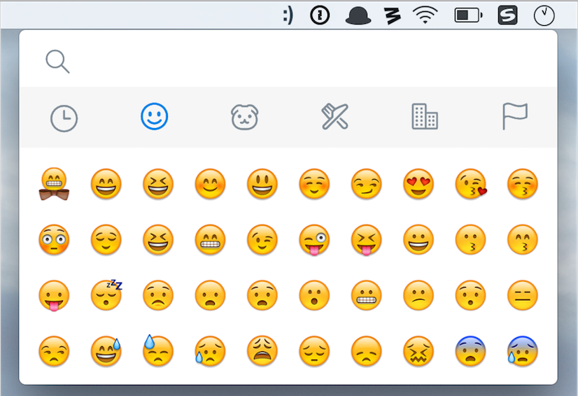
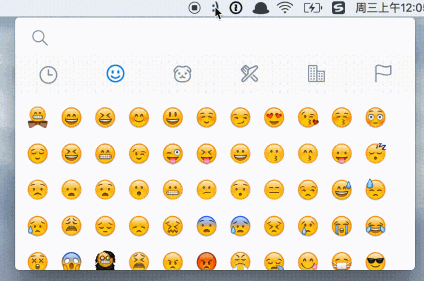

# emoji-menu


emoji-menu is an app for emoji retreive tool in the taskbar. Previews are as follows:

##### Mac OS X


##### Windows


### Install
+ download from release page, and move it to the app directory (there are two versions of the package: dmg and exe)

### Usage


### Build
```
git clone https://github.com/lazybios/emoji-menu
cd emoji-menu
npm install
npm run start
# build mac version
npm run build
```

### Todo
+ Shortcut support
+ Copied emoji charset first
+ Autolaunched after startup
+ Exceptions window
+ Reset recently used

### Contributing
1. Fork it!
2. Create your feature branch: `git checkout -b my-new-feature`
3. Commit your changes: `git cz` （We use [cz-cli](https://github.com/commitizen/cz-cli) and [AngularJS's commit message convention](https://github.com/angular/angular.js/blob/master/CONTRIBUTING.md#-git-commit-guidelines) to make our commit message more clearly）
4. Push to the branch: `git push origin my-new-feature`
5. Submit a pull request and enjoy!  :yum:

### Contributors
+ [runfastlynda](https://github.com/runfastlynda)
+ [lazybios](https://github.com/lazybios)

### Thanks to :heart:
+ [menubar](https://github.com/maxogden/menubar)
+ [emoji-cheat-sheet](https://github.com/arvida/emoji-cheat-sheet.com/)
+ [electron](https://github.com/electron/electron)
+ [mojibar](https://github.com/muan/mojibar)


### Emoji Supported Softwares
[Campfire](http://campfirenow.com/),
[GitHub](http://github.com/),
[Basecamp Next](http://37signals.com/basecampnext/),
[Redbooth](http://redbooth.com/),
[Trac](http://trac-hacks.org/wiki/TracEmojiPlugin),
[Flowdock](https://www.flowdock.com/),
[Sprint.ly](https://sprint.ly/),
[Kandan](http://getkandan.com/),
[Textbox.io](http://textbox.io/),
[Kippt](http://kippt.com),
[Redmine](https://github.com/tmy/redmine_gemoji),
[JabbR](http://about.jabbr.net/),
[Trello](https://trello.com/),
[Hall](https://hall.com/),
[Qiita](http://qiita.com/),
[Zendesk](http://zendesk.com/),
[Ruby-China](http://ruby-china.org/),
[Grove](https://grove.io/),
[Idobata](https://idobata.io/),
[NodeBB Forums](https://nodebb.org),
[Slack](https://slack.com),
[Streamup](https://streamup.com/),
[OrganisedMinds](http://organisedminds.com),
[Hackpad](https://hackpad.com),
[Cryptbin](https://cryptbin.com/),
[Kato](https://kato.im),
[Reportedly](http://reportedly.co),
[Cheerful Ghost](http://cheerfulghost.com),
[IRCCloud](https://www.irccloud.com),
[Dashcube](https://dashcube.com),
[MyVideoGameList](http://myvideogamelist.com),
[Subrosa](https://subrosa.io),
[Sococo](https://www.sococo.com),
[Quip](https://quip.com),
[And Bang](https://andbang.com),
[Bonusly](https://bonus.ly),
[Discourse](https://discourse.org),
[Ello](https://ello.co),
[Twemoji Awesome](http://ellekasai.github.io/twemoji-awesome/),
[ReadMe.io](https://readme.io),
[esa](https://esa.io/),
[DBook](https://www.DBook.org),
[Groups.io](https://groups.io),
[TeamworkChat](http://www.teamwork.com/chat),
[Damn Bugs](https://bugtrack.in),
[Let's Chat](https://sdelements.github.io/lets-chat),
[Buildkite](https://buildkite.com),
[IGDB.com](https://www.igdb.com/forums),
[ChatGrape](https://chatgrape.com),
[Dokuwiki](https://github.com/squarefractal/githubemoji-dokuwiki),
[Usersnap](https://usersnap.com),
[Discord](https://discordapp.com/),
[Status Hero](https://statushero.com/),
[Morfy](http://morfy.org/),
[Gitter](https://gitter.im/),
[Yellow](http://datenstrom.se/yellow/),
[YouTube](https://youtube.com),
[Mattermost](http://www.mattermost.org/),
[Atom](https://atom.io/),
[Ruby-China](ruby-china.org).
